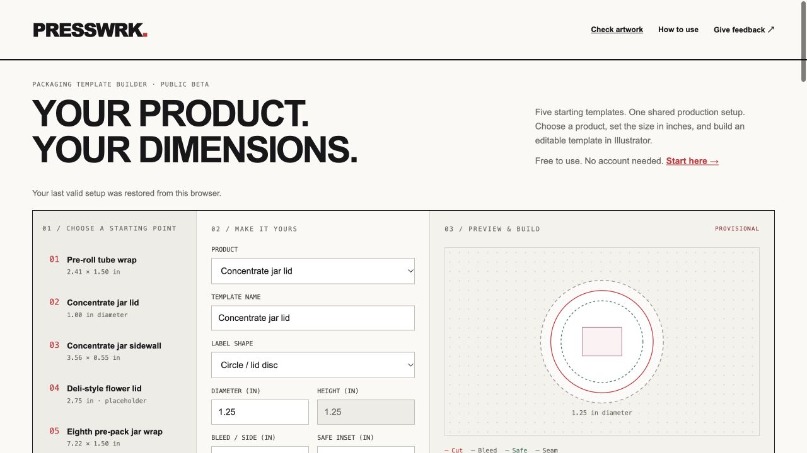

# PRESSWRK. — Packaging Template Builder

## 🚀 Live Demo

**[Open the template builder](https://presswrks-template-builder.vercel.app/)** · [Send feedback](https://github.com/cannacre8ive/presswrks-template-builder/issues/new/choose)

Five packaging presets and custom dimensions, with a schematic preview of cut, bleed, safe area and overlap. Download an editable Illustrator script or share the exact setup with someone reviewing your work. No account is needed to use the builder.

## Use it

1. Choose a preset or Custom template. Enter decimal inches; lid diameter controls both dimensions.
2. Inspect the preview and resolve any geometry errors. Confirm actual container measurements separately.
3. Download Illustrator script. In Adobe Illustrator choose **File → Scripts → Other Script…**, run the `.jsx`, and choose an output folder.
4. Add your artwork to the generated `.ait`, inspect separations and test fit before production.

**Share this setup** copies a link containing the template name and dimensions. Use a non-confidential name. Your last valid setup stays in your browser when storage is available. GitHub feedback requires a GitHub account and is public.

Adobe Illustrator is required to create `.ait` documents. This public beta has browser and geometry verification; Illustrator execution, saved templates, separation output and physical fit still need verification in your environment. The app is not a compliance checker.

[Offline HTML builder](https://presswrks-template-builder.vercel.app/PRESSWRKS-Template-Builder.html) · [Illustrator-native dialog](https://presswrks-template-builder.vercel.app/PRESSWRKS-Template-Builder.jsx)

## Quick setup

Node 24 and Python 3 for the optional local server. The builder and local artwork checker need no API keys. PDF.js and pdf-lib are bundled locally. The optional Drive intake requires a separately authorized Google Apps Script deployment.

```sh
npm ci
npm run check
npm run dev
```

Open http://127.0.0.1:8872. `npm run build` generates `dist/index.html` and a self-contained offline HTML from the same source. Vercel publishes `dist/` and the `/api/intake` function.

## Architecture

Plain HTML, CSS and JavaScript. `src/engine.js` owns the geometry and ES3-compatible Illustrator generator; `src/app.js` owns the form; `src/sharing.js` validates URL configurations. A small Node build embeds one engine into the web runtime and downloaded scripts, avoiding duplicate-source drift. No telemetry or external fonts. The checker reads same-origin PDF assets and an intake-availability endpoint; artwork stays local until explicit submission. See [ARCHITECTURE.md](ARCHITECTURE.md).

## Presets

| Preset | Starting trim |
|---|---|
| Pre-roll tube wrap | 2.410 × 1.500 in |
| Concentrate jar lid | 1.000 in diameter |
| Concentrate jar sidewall | 3.560 × 0.550 in |
| Deli-style flower lid | 2.750 in diameter, provisional placeholder |
| Eighth pre-pack wrap | 7.220 × 1.500 in |

All are editable. Generated documents target CMYK, 300 ppi, ten named layers, CutContour and four additional spot swatches. White and gloss artwork must be supplied; unused swatches do not make plates. Tapered / arc dielines are outside this version.

## Artwork check and client intake

[Open the artwork checker](https://presswrks-template-builder.vercel.app/#artwork). PDF, JPG and PNG are inspected locally against the selected trim and bleed dimensions. Raster checks calculate effective PPI and detect RGB/CMYK encoding. PDF checks inspect trim/bleed boxes and measurable image placements across up to 10 pages; PDF color remains a manual prepress check. No automatic conversion or upscaling.

Download a check report or complete a project brief with contact, scope, quantity, versions, material, finish and deadline. File intake is **not activated** until the private Google connection is authorized and configured. The UI states this clearly and never simulates receipt. Local checks accept 25 MB; the optional submission adapter currently accepts 3 MB.

The prepared adapter saves client/project folders, original artwork, brief and estimating inputs. It adds a separate Website Intake tab to the job-control workbook. It does not append incoming requests to the production-actuals ledger, expose internal rates or approve a print run. [Connection setup](integrations/google-apps-script/SETUP.md).

## Recent updates

- 2026-09-28: Local artwork preflight, sample files, project briefs and a private Drive intake adapter (activation pending).
- 2026-09-28: Brand corrected to **PRESSWRK.**; same public link.

- 2026-09-28: Public beta release, stronger PRESSWRK. wordmark with red period, setup-sharing links, local recall, reset, keyboard focus and feedback entry.
- Single-source generator, 24 automated geometry/sharing checks, repository documentation and real UI social preview.

See [CHANGELOG.md](CHANGELOG.md), [TESTING.md](TESTING.md), and [ROADMAP.md](ROADMAP.md). The original browser builder is preserved with a checksum under `source/`. Original source notes are provenance, not release instructions.

## Sharing

Suggested description: “PRESSWRK. turns packaging dimensions into editable Illustrator templates. Try a preset or your own size, preview the geometry, and send feedback.”

Production: https://presswrks-template-builder.vercel.app/  
Repository: https://github.com/cannacre8ive/presswrks-template-builder
